# SaarthiAI - System Architecture

## Overview
SaarthiAI is an AI-powered intelligent mobility ecosystem designed for India's unique multimodal transportation landscape.

Core Statement: "Inspired by global intelligent mobility practices, SaarthiAI is designed around India's unique multimodal and last-mile transportation ecosystem."

Product Statement: "SaarthiAI = One intelligent platform for the entire Indian commuting journey. Plan smarter → Predict better → Travel easier."

## Conceptual Architecture

```mermaid
graph TD
    Users((Users))
    subgraph Users_Layer
        Commuter[Commuter]
        Operator[Operator]
        Admin[Admin]
    end
    Users --- Commuter
    Users --- Operator
    Users --- Admin

    subgraph Application_Layer
        SaarthiApp[SaarthiAI Application]
        Commuter_Interface[Commuter App]
        Operator_Dash[Operator Dashboard]
        Admin_Dash[Admin Dashboard]
        SaarthiApp --- Commuter_Interface
        SaarthiApp --- Operator_Dash
        SaarthiApp --- Admin_Dash
    end

    Commuter --> Commuter_Interface
    Operator --> Operator_Dash
    Admin --> Admin_Dash

    subgraph Intelligence_Layer
        Engine[SaarthiAI Engine]
        Crowd[Crowd Prediction]
        Traffic[Traffic Prediction]
        Disruption[Disruption Prediction]
        Route[Route Optimization]
        Pers[Personalization]
        Fare[Fare Optimization]
        Safety[Safety Intelligence]
        Access[Accessibility Intelligence]
        
        Engine --- Crowd
        Engine --- Traffic
        Engine --- Disruption
        Engine --- Route
        Engine --- Pers
        Engine --- Fare
        Engine --- Safety
        Engine --- Access
    end

    SaarthiApp --> Engine

    subgraph Data_Integration_Layer
        API[Mobility APIs / Open Mobility Networks]
        ONDC[ONDC Mobility]
        GTFS[GTFS Feeds]
        Weather[Weather & Events APIs]
        Payments[NCMC / Payment Gateways]
        
        API --- ONDC
        API --- GTFS
        API --- Weather
        API --- Payments
    end

    Engine --> API

    subgraph Transport_Operators_Layer
        Operators[Transport Operators]
        Buses[Buses]
        Metro[Metro]
        Local[Local Trains]
        ERick[E-Rickshaws]
        Shared[Shared Mobility]
        
        Operators --- Buses
        Operators --- Metro
        Operators --- Local
        Operators --- ERick
        Operators --- Shared
    end

    API --> Operators
```

## Key Differentiators
Existing mobility apps generally provide: information, booking, ticketing, and route discovery.
SaarthiAI focuses on: **Prediction → Personalization → Recommendation → Action.**

Example comparison:
- **Existing:** "Bus arrives in 5 minutes."
- **SaarthiAI:** "Bus arrives in 5 minutes, but it is predicted to reach 90% occupancy. The next bus is expected to be 55% occupied. Waiting 7 minutes may give you a better journey."

SaarthiAI proposes an integrated AI intelligence layer that combines these capabilities for India's fragmented multimodal commuting ecosystem. 

*Note: Do not confuse existing technology (digital ticketing, mobility cards, route planning, etc.) with SaarthiAI's proposed innovation—a unified AI decision layer offering personalized commute intelligence, predictive crowd-aware recommendations, and active ecosystem orchestration.*

## India-First Design
SaarthiAI is designed specifically for Indian conditions: high-density public transport, widespread reliance on buses, metro, local trains, e-rickshaws, autos, and shared mobility. The system handles complex multimodal journeys, ₹ pricing logic, diverse Indian cities, unique Indian commuting patterns, frequent festival/event disruptions, monsoon/flooding scenarios, diverse accessibility challenges, and intricate last-mile connectivity gaps.

## Japan-Inspired, India-Adapted
"Inspired by global intelligent mobility practices" - borrowing concepts from advanced ecosystems like Japan's, including integrated public transport networks, crowd intelligence, predictive congestion management, universal mobility cards, seamless multimodal journey planning, and people-flow analysis. These concepts are meticulously adapted to the Indian transportation reality where unorganized sectors often serve as the vital last-mile link.

## Technology Stack

| Layer | Technologies |
|---|---|
| **Frontend** | React 18, Vite, Tailwind CSS, Zustand, React Router v6, Recharts, Leaflet |
| **Backend** | Node.js, Express.js |
| **Database** | MongoDB, Mongoose ODM |
| **Security/Auth** | JWT, bcrypt |
| **AI/Intelligence** | Custom heuristics, ML integration layers (OpenAI/Gemini APIs) |
| **Deployment** | Docker, AWS/GCP (Planned) |

## Backend Architecture
- **Express.js REST API server:** High-performance, scalable Node.js foundation.
- **MongoDB + Mongoose ODM:** Document database providing the flexibility needed for geospatial and multimodal data.
- **JWT authentication + bcrypt:** Secure, stateless token-based auth with encrypted credentials.
- **Role-based access control:** Separation of privileges (Commuter, Operator, Admin).
- **Modular service layer:** Clear separation of concerns mapping to controllers and routes.
- **Core Modules:** Implements rate limiting, robust validation, centralized error handling, across 18 API route groups, 21 controllers, and 11 services.

## Frontend Architecture
- **React 18 + Vite:** Fast rendering and optimized build processes.
- **Tailwind CSS:** Implementing a tailored White + Sky Blue design system.
- **Zustand state management:** Lightweight, un-opinionated state sharing.
- **React Router v6:** Enabling lazy loading for performance.
- **Recharts:** Providing analytical data visualization.
- **Leaflet:** Delivering interactive and responsive mapping capabilities.
- **Structure:** Encompasses 24 screens and 13 reusable components.

## AI/Intelligence Architecture
1. **Route Scoring Engine**: A multi-variable weighted scoring algorithm to rank commute options.
2. **Crowd Prediction Service**: Uses historical and time/day/weather factors to estimate vehicle and station crowding.
3. **Traffic Intelligence**: Monitors real-time status and predicts upcoming bottlenecks.
4. **Disruption Prediction**: Assesses weather, events, and incidents to anticipate transit delays.
5. **Fare Optimization**: Analyzes user spending to suggest the most cost-effective travel passes.
6. **AI Chat Assistant**: Delivers context-aware, natural language support and transit recommendations.
7. **Last-Mile Intelligence**: Ranks walking, e-rickshaw, and auto options dynamically.
8. **Green Score**: Estimates CO₂ savings based on the chosen sustainable transit modes.
9. **Demo Simulation**: Simulates vehicle movement, crowd changes, and live disruptions for platform demonstration.

**Scoring Formula:**
`CommuteScore = (w_time × TimeScore) + (w_cost × CostScore) + (w_crowd × CrowdScore) + (w_safety × SafetyScore) + (w_access × AccessScore) + (w_env × EnvScore)`

## Security Architecture
- JWT for secure, stateless API authorization.
- bcrypt for robust password hashing.
- Role-based authorization validating Commuter, Operator, or Admin tokens.
- Input validation via middleware to prevent injection attacks.
- Rate limiting to protect against DDoS.
- Strict CORS policies.
- Environment variables management to ensure no API keys exist in the frontend bundle.

## Future Phases
- **Phase 2:** Real-time transport APIs (direct operator integrations).
- **Phase 3:** Real crowd sensor integration (IoT, CCTV).
- **Phase 4:** Actual NCMC/payment integration.
- **Phase 5:** Transport operator partnerships.
- **Phase 6:** City-wide mobility digital twin.
- **Phase 7:** Multi-city deployment.
- **Phase 8:** Nationwide intelligent mobility ecosystem.
