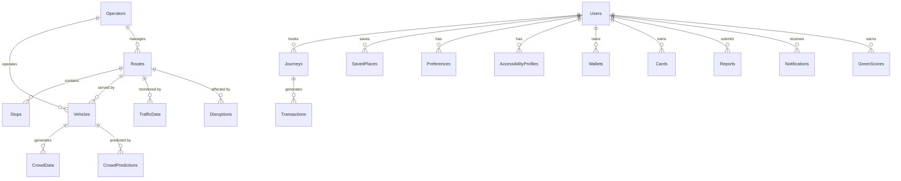

# Database Architecture

## Overview
SaarthiAI utilizes MongoDB with the Mongoose ODM to manage its flexible, document-oriented database requirements. The database consists of 22 distinct collections structured to support the complex multimodal transit ecosystem.

## Entity Relationship Diagram

## Collections Detail

### 1. Users
- **Purpose**: Stores all user accounts (Commuters, Admins, Operators).
- **Fields**: `_id` (ObjectId), `name` (String), `email` (String), `passwordHash` (String), `role` (Enum), `createdAt` (Date).
- **Indexes**: `{ email: 1 }` (Unique).
- **Relationships**: `Wallets`, `Cards`, `Preferences`, `AccessibilityProfiles`.
- **Example**: `{ "name": "Aryan", "email": "user@saarthi.ai", "role": "commuter" }`

### 2. Routes
- **Purpose**: Defines transit lines (bus routes, metro lines).
- **Fields**: `_id`, `routeNumber`, `type` (bus/metro), `origin`, `destination`, `polyline` (GeoJSON).
- **Indexes**: `{ routeNumber: 1 }`.
- **Relationships**: `Stops`, `Operators`.
- **Example**: `{ "routeNumber": "DTC-501", "type": "bus", "origin": "Saket", "destination": "CP" }`

### 3. Stops
- **Purpose**: Physical boarding/alighting points.
- **Fields**: `_id`, `name`, `location` (Point), `routeIds` (Array of ObjectIds).
- **Indexes**: `2dsphere` on `location`.
- **Relationships**: Refers to `Routes`.
- **Example**: `{ "name": "AIIMS Metro", "location": { "type": "Point", "coordinates": [77.20, 28.56] } }`

### 4. Vehicles
- **Purpose**: Individual transit units.
- **Fields**: `_id`, `registration`, `type`, `capacity`, `currentRoute` (ObjectId), `location` (Point), `status`.
- **Indexes**: `{ currentRoute: 1 }`.
- **Relationships**: Refers to `Routes`, `Operators`.
- **Example**: `{ "registration": "DL-1PC-1234", "type": "bus", "capacity": 60 }`

### 5. Journeys
- **Purpose**: User trip histories and active plans.
- **Fields**: `_id`, `userId`, `segments` (Array), `startTime`, `endTime`, `status`, `fareTotal`.
- **Indexes**: `{ userId: 1, startTime: -1 }`.
- **Relationships**: Refers to `Users`, `Routes`, `Vehicles`.
- **Example**: `{ "userId": "u1", "status": "completed", "fareTotal": 45 }`

### 6. SavedPlaces
- **Purpose**: User bookmarks (Home, Work).
- **Fields**: `_id`, `userId`, `label`, `location` (Point), `address`.
- **Relationships**: Refers to `Users`.

### 7. CrowdData
- **Purpose**: Historical and real-time occupancy readings.
- **Fields**: `_id`, `vehicleId`, `stopId`, `occupancyLevel` (0-100), `timestamp`.
- **Relationships**: Refers to `Vehicles`, `Stops`.

### 8. CrowdPredictions
- **Purpose**: AI-generated future crowd states.
- **Fields**: `_id`, `entityId` (Vehicle/Stop), `predictedTime`, `predictedOccupancy`, `confidenceScore`.
- **Relationships**: Refers to `Vehicles`, `Stops`.

### 9. TrafficData
- **Purpose**: Congestion metrics.
- **Fields**: `_id`, `routeSegmentId`, `speedMultiplier`, `congestionLevel`, `timestamp`.

### 10. Disruptions
- **Purpose**: Alerts, weather impacts, and events.
- **Fields**: `_id`, `title`, `description`, `type` (weather/accident/event), `affectedRoutes` (Array), `startTime`, `endTime`.

### 11. Reports
- **Purpose**: Community-sourced issues.
- **Fields**: `_id`, `userId`, `issueType`, `location`, `description`, `upvotes`, `status`.
- **Relationships**: Refers to `Users`.

### 12. Transactions
- **Purpose**: Financial ledger.
- **Fields**: `_id`, `walletId`, `amount`, `type` (credit/debit), `referenceId` (JourneyId), `timestamp`.

### 13. Wallets
- **Purpose**: User balance.
- **Fields**: `_id`, `userId`, `balance`, `currency`.

### 14. Cards
- **Purpose**: NCMC virtual cards.
- **Fields**: `_id`, `userId`, `cardNumber`, `status`, `expiry`.

### 15. Notifications
- **Purpose**: User alerts.
- **Fields**: `_id`, `userId`, `message`, `read`, `createdAt`.

### 16. Preferences
- **Purpose**: User routing weights (e.g., prefer less crowd, prefer cheap).
- **Fields**: `_id`, `userId`, `weights` (Object).

### 17. AccessibilityProfiles
- **Purpose**: Requirements for disabled/elderly users.
- **Fields**: `_id`, `userId`, `needsWheelchair`, `needsAudio`, `avoidsStairs`.

### 18. SafetyEvents
- **Purpose**: SOS triggers.
- **Fields**: `_id`, `userId`, `location`, `timestamp`, `resolved`.

### 19. Operators
- **Purpose**: Transit agency accounts.
- **Fields**: `_id`, `agencyName`, `contact`, `fleetSize`.

### 20. GreenScores
- **Purpose**: CO2 savings tracking.
- **Fields**: `_id`, `userId`, `totalCarbonSaved`, `rank`.

### 21. Analytics
- **Purpose**: Aggregate system metrics.
- **Fields**: `_id`, `date`, `totalJourneys`, `activeUsers`, `popularRoutes`.

### 22. DemoSimulations
- **Purpose**: Scenarios for demoing the app.
- **Fields**: `_id`, `scenarioName`, `steps` (Array of actions).
